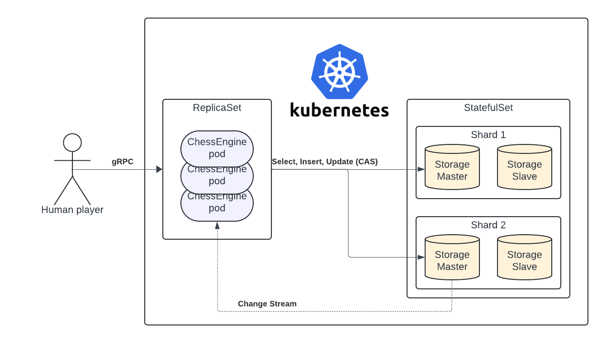
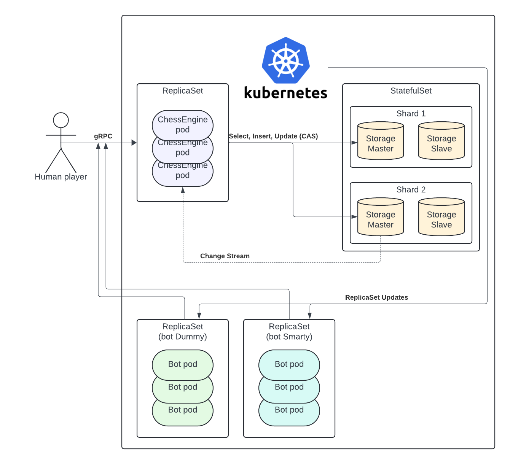

# **chesshub - design of a scalable and robust chess match system**

## Scope

To limit the scope of this design, I introduced certain limitations:

1. **Security.** I assume that authorization has already happened, and we can trust all the queries within the system. I also disregard any potential DoS attacks and the like. If required, access control can easily be implemented with a stateless gateway responsible for authorization and rate limits.
2. **Protocol & RPC.** I chose to use gRPC; it is by no means a hard requirement. I'm just more familiar with it, and schema makes it easier to describe API.
3. **DB.** The design described below requires the DB to support horizontal scalability, K8s integration, and subscriptions to stored object modifications. MongoDB satisfies those, so I decided to go with it. There are probably more suitable DBs, and for a real application, I would spend more time comparing them (one thing that comes to mind is stored procedure support, which would allow me to integrate the whole chess engine into the DB and get rid of ChessEngine ReplicaSet).

## Definitions

**Player** is an actor uniquely identified by PlayerID (string) who requests games and makes moves. Players can be humans or bots.

**GameContext** is a full game context uniquely identified by GameID (UUID). It is created once the Player requests a new game (that is, even before the Matching happens). The game context includes the player or players participating in the game, the current state of the game (like PLAYING and FINISHED), and the state of the board.

**Matching** means connecting two Players in the same Game.

**Bot** is a special kind of Player that implements some strategy and runs as a dedicated ReplicaSet.

All gRPC definitions should be available [here](proto/chesshub.proto).

## Player perspective

Here, I describe the progression of one game from a Player's perspective. Note that Player can have any number of games concurrently.

## Server architecture (no bots yet)

K8s manages all server processes. The main components are:

### ChessEngine ReplicaSet
Here all the incoming RPCs end up. ChessEngine has the following logic:
- **Match RPC**: try to find any existing games with state=WAITING_FOR_OPPONENT in *any* Sorage shard (can check shards one by one). If found, compare-and-swap (CAS, using context_version) this game to READY_TO_START and return GameID to the sender. If not found, create a new GameContext in the WAITING_FOR_OPPONENT state.
- **StartGame RPC** or **CancelGame RPC**: find the game context in Storage and set (CAS) ready_to_start flag of the sender; if both players are ready, promote (CAS) the game to WHITE_MOVE state. For CancelGame, promote to FINISH.
- **MakeMove RPC** or **Surrender RPC**: find the game context in Storage, apply the new move to the current board state. If there is a mate or Surrender RPC, promote to FINISH and set the winner. Update (CAS) game context accordingly. 
- **PollGame RPC**: use [Change Streams](https://www.mongodb.com/docs/manual/changeStreams/) to listen for any updates in the specified game. When they happen, return stream the new GameContext to the sender.
- **GameList RPC**: find all games for given player_id and stream them back to sender; (can be a lot of games, esp for bots, so should be streaming).

#### Monitoring
Since ChessEngine has all the logic related to the game, it is the best point to monitor the system. A node-level logging agent like Fluentd can be used to aggregate logs from ChessEngine pods and can also be integrated with Prometheus for metrics.

### Storage

MongoDB Storage responsible for
1. persisting GameContexts
2. update notification delivery
3. game Match lookups.

Implemented as a StatefulSet of master-slave pairs, sharded by GameID. The primary index is GameID; secondary index by PlayerID for GameList RPC; more secondary indices (by ColorPreference, etc) can be added for Matching optimization.

This *should* work, but I would try to set it up first before implementing everything else. My main concerns are:
- seamless horizontal scaling (I know StatefulSets can be tricky to manage).
- guaranteed GameContext notifications delivery. Need to read more about Change Streams in Mongo to understand how to make it robust.

## Server architecture (adding bots)

Each bot is registered under a separate PlayerID. Bots are expected to be the most CPU-consuming processes in the whole system, so every bot should be horizontally scalable. This is achieved in the following way:

A bot runs as a self-aware K8s ReplicaSet. Every bot pod is responsible for a subset of games held by the bot (for instance, shared by hash of GameID). When bot pod is launched, it calls GameList RPC to get all the games belonging to the bot, and starts watching K8s server for rescaling events on its own ReplicaSet. This allows bot pod to only process the games belonging to it. There is a race during rescaling which leads to one game being temporarily "played" by more than one bot, but this should be handled correctly by ChessEngine.

